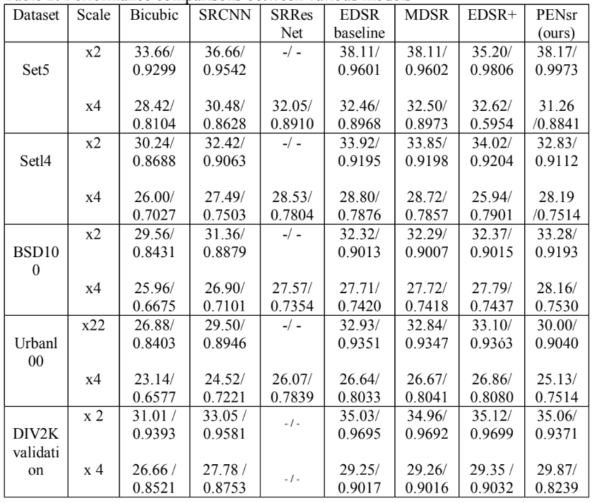

<h1 align="center">
  <br>
  PEN-sr
  <br>
</h1>

<h4 align="center">Phaser Enhanced Network for single image super resolution</h4>

<p align="center">
  <a href="#Description">Description</a> •
  <a href="#Features">Features</a> •
  <a href="#Performance">Performance</a> •
  <a href="#How To Use">How To Use</a> •
  <a href="#Downloading pre-trained weights">Download weights</a> •
  <a href="#Acknowledgments">Acknowledgments</a> •
  <a href="#license">License</a>
</p>


# Description

Phaser Enhanced Network for single image super resolution is machine learning modal that utilizes the phaser blocks to provide more contextual pattern during the training input phase which will help learn more pattern and better up-scaling results.

This project is the implementation of my thesis paper in computer vision and image processing field.

## Features

Key features of this repository include:

- Image super resolution Models trainer.
- Image super resolution Models tester.
- PEN-sr model.
- EDSR model.
- PSNR/SSIM calculators.
- Image cropper.
- Standard datasets downloader.
- training/testing curve monitoring.
- CPU/GPU training compatibility.

## Performance



## How To Use

The following is the necessary steps to setup the repository.

```bash
# Clone this repository
$ git clone https://github.com/Al-khattab/Phaser-Enhanced-Network-SR.git

# Go into the repository
$ cd Phaser-Enhanced-Network-SR

# Install dependencies
$ pip install requirements.txt

# or if you use anaconda
$ conda install requirements.txt
```

## Downloading pre-trained weights for PEN-sr

You can request the latest trained weights and all experiments from here

## Acknowledgments

This implementation was made possible thanks to:

- [EDSR-PyTorch](https://github.com/sanghyun-son/EDSR-PyTorch)
- [Hugging face](https://huggingface.co/models?other=image-super-resolution)

## License

[MIT](https://choosealicense.com/licenses/mit/)
